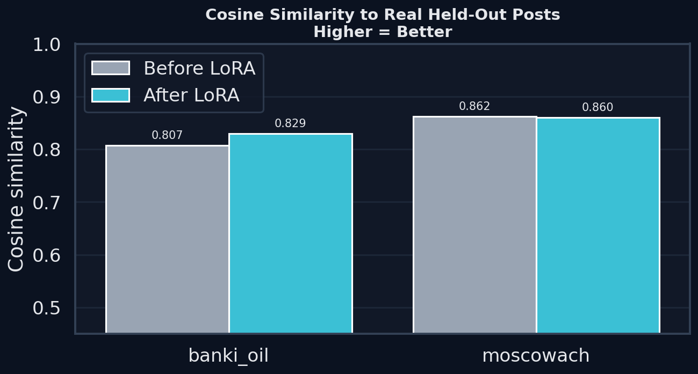
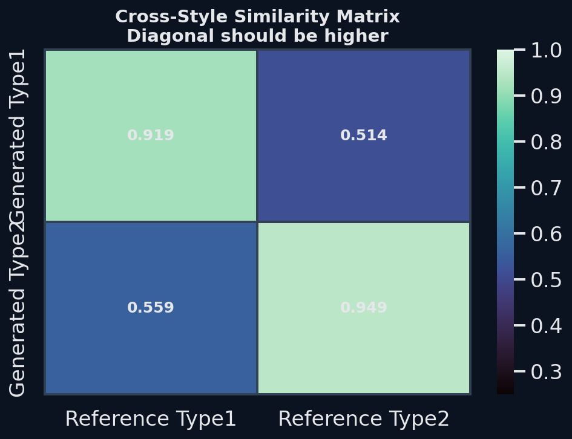

# RESULTS

## Что было сделано

Задача состояла в том, чтобы адаптировать базовую языковую модель под два разных Telegram-стиля:

1. **Тип 1** — стиль канала `banki_oil`
2. **Тип 2** — стиль канала `moscowach`

Важно, что готовый датасет для задачи не выдавался.  
Поэтому сначала я сам собрал данные из каналов, а затем уже построил на них компактный обучающий и тестовый набор.

---

## Как был собран датасет

### 1. Сырые корпуса каналов
Сначала я спарсил посты из двух Telegram-каналов и сохранил сырые корпуса:

- `banki_oil.txt`
- `moscowach.txt`

В каждом из этих файлов находится **большой набор реальных постов канала** (сотни примеров).

### 2. Маленький рабочий датасет для тестового
Поскольку по условию задания время ограничено, а обучение большой модели даже через LoRA всё равно требует ресурсов, я сознательно сделал **уменьшенную рабочую выборку**.

Из каждого большого корпуса я **случайно отобрал по 30 реальных постов** и сохранил их отдельно:

- `outputs_banki_oil.txt`
- `outputs_moscowach.txt`

Здесь слово `outputs` означает **реальные целевые тексты канала**, то есть эталоны стиля.

### 3. Построение нейтральных входов
Для каждого из этих 30 реальных постов я отдельно получил **нейтральную переформулировку** через модель, чтобы из стильного канального текста сделать обычный “исходный” текст без выраженного стиля канала.

Так были получены файлы:

- `inputs_banki_oil.txt`
- `inputs_moscowach.txt`

В итоге для каждого канала появились пары вида:

- **input** = нейтральный текст
- **output** = реальный пост канала

То есть датасет был построен мной полностью с нуля:
- сырые посты каналов,
- отбор под задачу,
- генерация нейтральных входов,
- сбор пар для обучения и проверки.

### 4. Разделение на train / test
После этого для каждого канала я разбил 30 пар на:

- **20 train** — для обучения LoRA
- **10 test** — для проверки качества на unseen-примерах

Это было сделано отдельно для каждого из двух стилей.

---

## Шаги решения

1. **Собрал сырые корпуса каналов**
   - `banki_oil.txt`
   - `moscowach.txt`

2. **Сформировал компактный датасет**
   - случайно отобрал по 30 реальных постов на канал;
   - получил:
     - `outputs_banki_oil.txt`
     - `outputs_moscowach.txt`

3. **Сделал нейтральные входы**
   - для выбранных постов сгенерировал нейтральные версии;
   - получил:
     - `inputs_banki_oil.txt`
     - `inputs_moscowach.txt`

4. **Построил пары `input -> output`**
   - нейтральный текст → реальный пост канала

5. **Разделил пары на train / test**
   - 20 примеров на обучение
   - 10 примеров на проверку

6. **Сгенерировал baseline до подстройки**
   - на отложенной test-части получил ответы базовой модели;
   - для baseline использовал нейтральный промпт без жёсткой привязки к стилю канала.

7. **Обучил две отдельные LoRA**
   - `lora_type1` — под стиль `banki_oil`
   - `lora_type2` — под стиль `moscowach`

8. **Сгенерировал финальные ответы**
   - после обучения снова прогнал test-примеры;
   - для каждого типа использовал соответствующий style prompt.

9. **Подготовил итоговые файлы по заданию**
   - `outputs_type1.txt` — финальные ответы для `inputs_type1.txt`
   - `outputs_type2.txt` — финальные ответы для `inputs_type2.txt`

---

## Конфигурация решения

- Базовая модель: `unsloth/Qwen3-14B`
- Загрузка: **4-bit**
- Подстройка: **LoRA**
- Количество эпох: **3**
- Параметры LoRA:
  - `r = 16`
  - `alpha = 16`

### Почему выбрана именно такая конфигурация

Датасет в тестовом специально сделан компактным, потому что задача ограничена по времени, а обучение даже через LoRA на большой модели остаётся затратным.

Кроме того, на маленьком наборе примеров высокий риск переобучения.  
Поэтому я:

- **уменьшил число эпох до 3**;
- использовал более умеренные настройки LoRA;
- старался не “дожимать” train loss любой ценой, а сохранить более устойчивое поведение на отложенных примерах.

Если бы задача решалась уже не как тестовое, а как полноценный рабочий эксперимент, логичным следующим шагом было бы:
- использовать **весь собранный корпус**,
- увеличить число train-примеров,
- прогнать больше комбинаций гиперпараметров.

---

## Что получилось хорошо

### 1. Для типа 1 (`banki_oil`) качество заметно улучшилось

#### Cosine similarity к held-out референсам
- до: **0.8073**
- после: **0.8293**
- улучшение: **+0.0220**

#### Style gap
- до: **0.3574**
- после: **0.4048**
- улучшение: **+0.0475**

#### Формальные признаки канала
- доля текстов с `@banki_oil`:
  - до: **0.0**
  - после: **1.0**
- доля текстов без эмодзи:
  - до: **0.7778**
  - после: **1.0**

Итог: для `banki_oil` LoRA не только улучшила близость к реальным постам, но и заметно усилила попадание в канальный формат.

---

### 2. Для типа 2 (`moscowach`) стиль стал устойчивее и лучше отделяться от другого типа

#### Cosine similarity
- до: **0.8620**
- после: **0.8601**
- изменение: **-0.0019**

Формально cosine немного снизился, но снижение **минимальное**.

#### Style gap
- до: **0.3380**
- после: **0.3907**
- улучшение: **+0.0528**

#### Формальные признаки канала
- доля текстов с ведущим эмодзи:
  - до: **0.0**
  - после: **1.0**

Итог: для `moscowach` cosine к конкретному эталонному тексту почти не изменился, но при этом результат стал заметно лучше соответствовать самому стилю канала по separation-метрикам и по очевидным формальным признакам.

---

### 3. Cross-style проверка показала хорошее разделение двух стилей

|                | Reference Type1 | Reference Type2 |
|----------------|-----------------|-----------------|
| Generated Type1 | 0.9189 | 0.5140 |
| Generated Type2 | 0.5585 | 0.9493 |

Это означает, что:

- тексты **типа 1** существенно ближе к референсам **типа 1**, чем к **типу 2**;
- тексты **типа 2** существенно ближе к референсам **типа 2**, чем к **типу 1**.

То есть модель не свелась к “среднему телеграм-стилю”, а реально научилась различать два режима генерации.

---

## Что получилось хуже / ограничения

### 1. Для типа 2 cosine similarity почти не вырос
Для `moscowach` cosine немного снизился: **0.8620 → 0.8601**.

Считаю, что это не критично, потому что:

- разница очень маленькая;
- cosine сравнивает результат с одним конкретным эталонным текстом;
- для коротких Telegram-постов возможны несколько корректных переформулировок одной и той же новости;
- при этом остальные более задачно-специфичные проверки улучшились:
  - вырос style gap;
  - сохранилась сильная cross-style separation;
  - появились более явные признаки нужного канала.

---

### 2. Структурные метрики улучшились не везде одинаково
Например:

- для `banki_oil` стало лучше по близости к числу предложений, но хуже по средней длине;
- для `moscowach` стало чуть лучше по длине, но хуже по числу предложений.

Поэтому структурные метрики я рассматривал как вспомогательные sanity-check, а не как главную оценку качества.

---

### 3. Маленький рабочий датасет
Для тестового я сознательно использовал **не весь собранный корпус**, а уменьшенную выборку:

- по 30 примеров на канал;
- 20 на train;
- 10 на test.

Это ускорило обучение и позволило уложиться в ограничение по времени, но, конечно, ограничило качество и стабильность метрик.

---

### 4. Ограниченные вычислительные ресурсы
Решение собиралось как компактный воспроизводимый MVP:

- free Colab;
- 4-bit загрузка;
- LoRA вместо полного fine-tuning;
- ограниченное число экспериментов с гиперпараметрами.

---

## Как я проверял, что стало лучше “до/после”

Сравнение делалось строго на **отложенной test-части**, которая не использовалась при обучении.

### Использованные проверки

1. **Cosine similarity до / после**
   - показывает, насколько результат близок к реальному held-out посту.

2. **Cross-style matrix**
   - проверяет, что каждый адаптер ближе именно к своему стилю, а не к другому.

3. **Style gap**
   - это разница между близостью к своему стилю и к чужому;
   - чем выше, тем лучше модель отделяет один тип контента от другого.

4. **Marker compliance**
   - для `banki_oil`: наличие `@banki_oil`, отсутствие эмодзи;
   - для `moscowach`: наличие ведущего эмодзи.

5. **Ручной просмотр примеров**
   - baseline и финальные тексты сравнивались также вручную на test-примерах.

---

## Почему это не запоминание примеров

Проверка делалась не на обучающих примерах, а на отдельной test-части.

Схема была такой:

- сначала из собранного мини-датасета формируются пары;
- потом пары делятся на train / test;
- LoRA обучается только на train;
- baseline и финальные метрики считаются только на test.

То есть модель не могла просто воспроизвести пары, которые уже видела во время подстройки.

Кроме того, сами входы были заранее приведены к нейтральной форме, а задача модели заключалась именно в обратной стилизации под конкретный канал.

---

## Что можно было бы улучшить дальше

Дополнительно, если бы было больше времени и вычислительных ресурсов, я бы усилил решение в следующих направлениях:

1. **Использовал бы весь собранный корпус каналов**, а не только уменьшенную выборку из 30 примеров на канал.

2. **Провёл бы больше экспериментов с гиперпараметрами**
   - число эпох;
   - learning rate;
   - LoRA rank;
   - генерационные параметры.

3. **Добавил бы более сильную оценку качества**
   - LLM-as-a-Judge с попарным сравнением baseline vs adapted;
   - отдельный style-classifier на базе encoder-модели уровня RuBERT / XLM-R;
   - метрики сохранения фактов:
     - числа,
     - даты,
     - сущности,
     - галлюцинации.

4. **Добавил бы анти-меморизационные проверки**
   - сходство с ближайшим train-примером;
   - n-gram overlap с обучающими текстами;
   - долю слишком близких к train outputs генераций.

5. **Сделал бы ручную слепую оценку несколькими annotators**
   - похожесть на канал;
   - сохранение фактов;
   - естественность текста.

---

## Основные графики

### Cosine similarity до / после

### Cross-style similarity matrix

## Дополнительные графики

- [Style gap](plot_style_margin.png)
- [Marker compliance](plot_style_compliance.png)

---

## Итог

Считаю, что в рамках ограничений тестового решение получилось рабочим и воспроизводимым:

- я самостоятельно собрал данные из каналов и подготовил пары для обучения;
- есть корректное сравнение **до / после**;
- есть проверка на held-out данных;
- есть отдельная подстройка под два разных типа контента;
- для `banki_oil` LoRA дала явное улучшение по основным метрикам;
- для `moscowach` cosine к конкретному эталону почти не изменился, но улучшились style separation и формальные признаки нужного стиля;
- cross-style проверка показывает, что два стиля остаются хорошо различимыми.

---

## Итоговые файлы

В репозитории приложены:

### Сырые корпуса каналов
- `banki_oil.txt`
- `moscowach.txt`

### Выбранные реальные посты для мини-датасета
- `outputs_banki_oil.txt`
- `outputs_moscowach.txt`

### Нейтральные входы для обучения и проверки
- `inputs_banki_oil.txt`
- `inputs_moscowach.txt`

### Финальные результаты по условию задания
- `outputs_type1.txt`
- `outputs_type2.txt`

### Также приложены
- код решения;
- ноутбук с запуском;
- baseline-файлы;
- метрики;
- графики.
